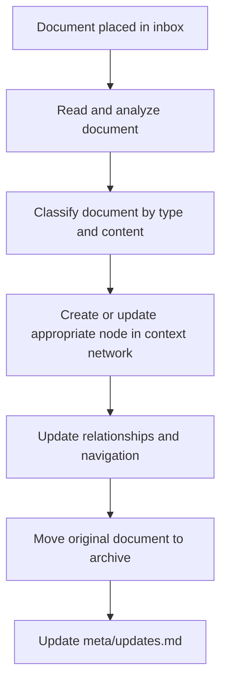

# Document Integration Process

## Purpose
This document outlines the process for integrating external documents from the inbox folder into the context network, with specific tracking for the Abstract Strategy Game Designer project integration.

## Classification
- **Domain:** Documentation
- **Stability:** Semi-stable
- **Abstraction:** Structural
- **Confidence:** Established

## Content

### Overview

The inbox folder serves as a temporary holding area for documents that need to be integrated into the context network. This process ensures that all documents are properly analyzed, structured, and integrated into the appropriate locations within the context network.

### Current Integration Project Status

#### Active Integration: Abstract Strategy Game Design Documents

**Documents to Process:**

1. **Abstract Strategy Game Brainstorming Framework.md**
   - Status: Fully Integrated
   - Completed: All content integrated into creative-ideation section
   - Location: elements/creative-ideation/

2. **Abstract Strategy Game Design Framework.md**
   - Status: Fully Integrated  
   - Completed: All content distributed across relevant sections
   - Locations: design-methodologies/, game-mechanics/, evaluation-testing/

3. **Abstract Strategy Game Notation Development Framework.md**
   - Status: Fully Integrated
   - Completed: Complete notation framework created
   - Location: elements/notation-systems/

4. **Comprehensive Framework for Abstract Strategy Game.md**
   - Status: Fully Integrated
   - Completed: Resources extracted and organized
   - Location: elements/resources-tools/

5. **abstract-game-design-resources.md**
   - Status: Fully Integrated
   - Completed: All resources cataloged with actionable organization
   - Location: elements/resources-tools/

**Integration Progress:**
- ✅ Foundation documents updated for game design focus
- ✅ Main elements structure created (8 categories)
- ✅ All design methodologies documented
- ✅ Creative ideation techniques fully extracted
- ✅ Game mechanics comprehensively cataloged
- ✅ Notation development framework complete
- ✅ Evaluation and testing protocols documented
- ✅ Resources and tools organized by utility
- ✅ Implementation guidance provided
- ✅ All inbox content successfully integrated

### Step 1: Document Analysis

When a new document appears in the inbox folder:

1. Read the document thoroughly to understand its content and purpose
2. Identify the primary domain(s) the document relates to
3. Determine the document's classification along the standard dimensions:
   - Domain (primary knowledge area)
   - Stability (change frequency expectation)
   - Abstraction (detail level)
   - Confidence (information reliability)
4. Identify key concepts, decisions, or processes described in the document
5. Note relationships to existing information in the context network

### Step 2: Integration Planning

Based on the analysis:

1. Determine where the information belongs in the context network structure
   - Foundation documents → `foundation/`
   - Element-specific information → `elements/[element]/`
   - Process documentation → `processes/`
   - Decision records → `decisions/`
   - Planning information → `planning/`
   - Connection concerns → `connections/`
2. Decide whether to:
   - Create a new information node
   - Update an existing node
   - Extract multiple pieces of information for different nodes

### Step 3: Content Structuring

For each piece of information to be integrated:

1. Format the content according to the standard information node template
2. Ensure all required sections are included:
   - Purpose
   - Classification
   - Content
   - Relationships
   - Navigation Guidance
   - Metadata
   - Change History
3. Structure the content for clarity and navigability
4. Include relevant diagrams, code snippets, or examples as needed

### Step 4: Relationship Mapping

For each new or updated node:

1. Identify and document hierarchical relationships:
   - Parent nodes (broader context)
   - Child nodes (more detailed information)
2. Map associative relationships:
   - Related concepts
   - Dependencies
   - Implementations
   - Extensions
   - Contradictions
   - Complementary information
3. Document cross-element relationships:
   - Interfaces
   - Translations
   - Impacts

### Step 5: Integration Execution

Perform the actual integration:

1. Create or update the appropriate files in the context network
2. Ensure all relationships are bidirectional (referenced in both connected nodes)
3. Update any index files or navigation guides as needed
4. Verify that the integration maintains the overall coherence of the network

### Step 6: Document Archiving

After successful integration:

1. Move the original document to the `archive/` folder
2. Rename the file to include the date of processing if needed
3. Ensure the archived document is preserved for future reference

### Step 7: Update Logging

Record the integration in the update log:

1. Open `meta/updates.md`
2. Add a new entry with:
   - Date of integration
   - Document(s) processed
   - Nodes created or updated
   - Brief description of the changes
   - Any follow-up actions required

## Relationships
- **Parent Nodes:** [processes/creation.md]
- **Child Nodes:** None
- **Related Nodes:** 
  - [meta/updates.md] - Records changes from document integration
  - [meta/maintenance.md] - Overall maintenance procedures

## Navigation Guidance
- **Access Context:** Use this document when processing new documents in the inbox folder
- **Common Next Steps:** After following this process, typically update meta/updates.md
- **Related Tasks:** Document classification, information structuring, relationship mapping
- **Update Patterns:** This process may be refined based on experience with document integration

## Metadata
- **Created:** [Date]
- **Last Updated:** [Date]
- **Updated By:** [Role/Agent]

## Change History
- [Date]: Initial creation of document integration process
